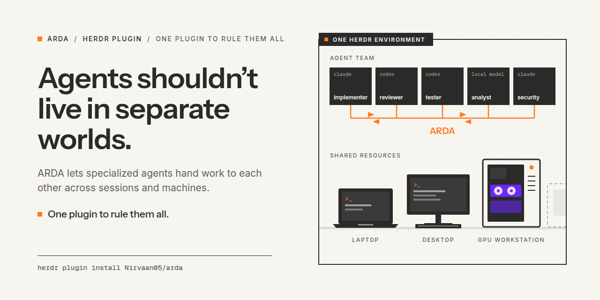

# ARDA

**Agent interoperability for everyday work, starting with the tools you already use.**

**ARDA. One plugin to rule them all.**

The [Herdr](https://herdr.dev) plugin is available now: agents discover peers and exchange
work without making you relay every message. ARDA is working toward installable
[A2A](https://a2a-protocol.org/v1.0.0/) interoperability; today's plugin uses its own
`arda/1` protocol.

[Quick start](#quick-start) · [Current support](#current-support-and-limitations) ·
[Protocol](docs/protocol.md)



## The problem

You might ask one agent to research, another to plan or write, and another to review or
execute. Their tools, models, costs and permissions differ. Yet moving work between
products and terminals often means copying context by hand or building an integration
for each pairing. This affects everyday design and business work as well as software.

ARDA aims to make that connection an installable, reusable capability. You keep the
agents you already use and stop being their message relay where integration is supported.

## A2A and ARDA

The [Agent2Agent (A2A) open standard](https://a2a-protocol.org/v1.0.0/) defines communication
between independently implemented agents across frameworks and vendors. An agent can
expose a compatible interface while keeping its internal tools, memory and proprietary
logic private.

**A2A defines the standard; ARDA is building the practical integration experience.**
Common protocol support and reusable adapters can reduce custom glue while systems keep
their own models and runtimes. A closed-source product still needs a supported interface,
API, protocol endpoint or compatible adapter; connection is not automatic.

**Today's boundary:** ARDA implements discovery, addressed messages and task handoff
conventions inside Herdr. It does **not** implement A2A Agent Cards, its canonical data
models, operations or protocol bindings. Similar task concepts do not establish A2A
compliance. See the [implementation comparison](docs/protocol.md#relationship-to-a2a).

## The mental model

**You set the goal, establish boundaries and make decisions. Agents do the work and
communicate within those boundaries.**

| Part | Responsibility |
| --- | --- |
| Existing environments | Host agents and expose ways to reach them. Herdr is integrated today; Orca is next. |
| Agents | Choose whom to ask, carry out work and return results using their existing tools and permissions. |
| Machines and runtimes | Provide execution resources: a laptop, server, GPU workstation or permitted sandbox. |
| ARDA | Defines how agents address one another, request work, acknowledge it and answer. |

ARDA is a thin Python communication layer, not a persistent agent platform, model router,
runtime or central control plane. More: [mental model](docs/mental-model.md).

## How it works today

The short-lived Python command `arda` calls Herdr's CLI, then exits:

1. **Discover:** `arda peers` lists agents in running local Herdr sessions and enabled
   saved machines. `arda describe` publishes role, tools and model as Herdr metadata.
2. **Address:** use `@reviewer`, or `@reviewer@desktop` to select a place. ARDA refuses an
   ambiguous or incomplete lookup and rechecks the receiver before sending.
3. **Hand off:** `arda task` sends an `arda/1` `task_request` as a Herdr agent prompt.
   Its footer tells the receiver how to answer. `arda send` sends a `note`.
4. **Answer:** the receiver sends `ack`, then `result` or `reject`, referencing the task
   ID. Replies arrive as new prompts. These are agent conventions, not an enforced workflow.

| Delivery outcome | What ARDA knows |
| --- | --- |
| `delivered` | Herdr observed working state or an approval/question prompt after submission. |
| `submitted` | Input was submitted to a busy agent; its harness controls when it is consumed. |
| `uncertain` | The message may have arrived, but confirmation failed. Do not resend blindly. |
| `not_delivered` | Nothing was sent, for example because the address could not be resolved or the agent was blocked. |

**Delivery is not acceptance or completion.** Look for the receiver's `ack`, then
`result` or `reject`. A [recorded Claude Code/Codex exchange](docs/examples/team-workflow.md)
shows this working live.

## Why ARDA

- **Keep your systems.** Retain existing agents, tools and permission controls.
- **Reuse the handoff format.** Names, task IDs and reply instructions reduce custom
  glue in Herdr today; reusable adapters are the path toward broader interoperability.
- **Operate no ARDA backend.** The Python runtime uses the standard library. No ARDA-hosted
  API, daemon or central database is needed. See [data handling](#security-and-trust).

## Current support and limitations

**Available now: the shipped Herdr plugin on Linux and Windows.** VERIFIED records the
maintainer's live verification; it does not mean every harness or runtime is compatible.
See the [status definitions](docs/README.md#status-labels).

| Capability | Status | Scope |
| --- | --- | --- |
| Claude Code and Codex handoffs | **VERIFIED** | In Herdr, including a session on native Windows. |
| Discovery and messaging across local Herdr sessions | **VERIFIED** | Running sessions on the same machine. |
| Messaging across machines saved in Herdr | **VERIFIED** | Reachable SSH routes; replies require a route back. |
| OpenCode and Gemini handoffs | **VERIFIED** | Where Herdr detects and can prompt them; `arda-trust` configures only Claude Code and Codex. |
| Self-descriptions and exact model lookup | **VERIFIED** | Descriptions are claims; `--model auto` reads Claude Code or Codex session logs. |
| Reply addresses that survive renames | **VERIFIED** | With Herdr's Claude Code/Codex conversation integrations. |
| Sandboxed or cloud agents reached through Herdr | **VERIFIED** | Runtime permissions must allow ARDA's commands and connections. |

There is no persistent queue, automatic message retry, replay protection or completion
guarantee. Herdr's state detection can miss harness dialogs. Remote replies need ARDA on
both ends and saved Herdr routes in both directions. Files and unpushed commits do not
move with a message. Other host environments and A2A endpoint connectivity remain
[future work](#project-direction).

## Quick start

You need **Herdr 0.9.3+**, **Python 3.11+**, and installed agents Herdr can run. This
example uses Claude Code and Codex in two panes of one Herdr session, in the same project.
Linux needs `python3` in the standard system PATH. On Windows, follow the
[Windows setup guide](docs/guides/windows.md), including the `py` launcher, pip and Codex
environment/sandbox requirements; plugin action IDs have a `-windows` suffix.

**1. Install and approve on Linux.** Run these yourself in a plain terminal, with your
intended Claude Code and Codex configuration profiles selected:

```sh
herdr plugin install Nirvaan05/arda
plugin_root=$(herdr plugin list --plugin arda --json |
  python3 -c 'import json, sys; print(json.load(sys.stdin)["result"]["plugins"][0]["plugin_root"])')
mkdir -p "$HOME/.local/bin"
ln -s "$plugin_root/bin/arda" "$plugin_root/bin/arda-trust" "$HOME/.local/bin/"
export PATH="$HOME/.local/bin:$PATH"
arda-trust          # preview the configuration changes
arda-trust --yes    # apply only after reviewing them
```

Keep `~/.local/bin` on your PATH in future sessions. Existing links can be kept if they
already point to this installation. Approval writes rules into the selected harness
profiles and installs their Herdr integrations. It does not authorize every action or
every harness. Read [what changes and how to revoke it](docs/guides/trust-and-consent.md).

**2. Start named agents.** Start Herdr with `herdr`, open two shell panes in the same
project, and use `herdr pane current` in each to obtain its ID. Replace the placeholders:

```sh
herdr agent start implementer --kind claude --pane <implementer-pane>
herdr agent start reviewer --kind codex --pane <reviewer-pane> -- --no-daemon
```

Once both agents are idle, run this from a plain shell pane in the same Herdr session:

```sh
herdr plugin action invoke introduce --plugin arda
```

**3. Give the implementer a bounded task:** “Ask the reviewer to review the last commit,
read-only, and return its findings to me.” The agent can discover its peer and send:

```sh
arda peers
arda task @reviewer -- 'Review the last commit. Read-only; do not edit files. Done when: findings with file:line, or no issues. Return the findings through ARDA.'
```

The reviewer uses the `arda ack` and `arda result` commands in the received footer,
or `arda reject` if it cannot take the task. Replies reach the implementer, which reports
back to you.

Full walkthrough: [getting started](docs/getting-started.md). For another machine, follow
the [multi-machine guide](docs/guides/multi-machine.md) on both ends.

## Protocol and documentation

| Topic | Read |
| --- | --- |
| Addresses, message format, handoffs and delivery rules | [Protocol: arda/1](docs/protocol.md) |
| A2A standard and current implementation gaps | [Official A2A 1.0 specification](https://a2a-protocol.org/v1.0.0/specification/), [ARDA comparison](docs/protocol.md#relationship-to-a2a) |
| Commands, options, exit codes and JSON output | [CLI reference](docs/reference/cli.md) |
| Responsibilities and data flow | [Mental model](docs/mental-model.md), [architecture](docs/architecture.md), [discovery](docs/discovery.md) |
| Harness setup | [Claude Code](docs/guides/claude-code.md), [Codex](docs/guides/codex.md), [Windows](docs/guides/windows.md) |
| Examples | [Recorded handoff](docs/examples/team-workflow.md), [illustrative distributed team](docs/examples/distributed-team.md) |
| Help | [Troubleshooting](docs/troubleshooting.md), [documentation index](docs/README.md) |

## Security and trust

**ARDA itself collects no telemetry or user data.** It processes the message text you
ask it to send, without an ARDA collection endpoint or message database. Text passes
through Herdr into another agent's prompt, using SSH for saved machines. Host systems,
agent transcripts, tools and model providers may transmit or retain that content under
their own policies. The absence of an ARDA backend does not guarantee privacy across
the whole environment.

Setup writes local harness rules and, on Windows, an executable launcher. Self-descriptions
live in Herdr metadata; optional model detection reads the agent's own local session log.

Messages are **not authenticated**. Reply fingerprints reduce misrouting; they do not
prevent forgery. Peer requests can contain prompt injection and carry no user authority.
The human decides which peers may collaborate. Harness permissions, sandbox policy and
SSH credentials remain essential boundaries; a protocol alone does not ensure security.
See [trust and consent](docs/guides/trust-and-consent.md) before granting standing approval.

## Project direction

Start with Herdr and Orca, systems the creator already uses, then learn from each integration.

- **Shipped:** the Herdr plugin establishes the initial implementation in an existing
  agent environment.
- **Next, planned:** integrate [Orca](https://github.com/stablyai/orca). There is no Orca
  adapter in this repository yet.
- **Future ambition:** learn from more projects and build toward an installable
  implementation of the A2A model, connecting independently developed agents, including
  compatible closed-source systems, across fields of work.

Build on existing systems, learn from each integration, then generalize. Broader A2A
support and universal interoperability remain goals, not completed capabilities.

To contribute, start with [contributing](docs/contributing.md). Coding agents should
also read [AGENTS.md](AGENTS.md). [MIT license](LICENSE).
