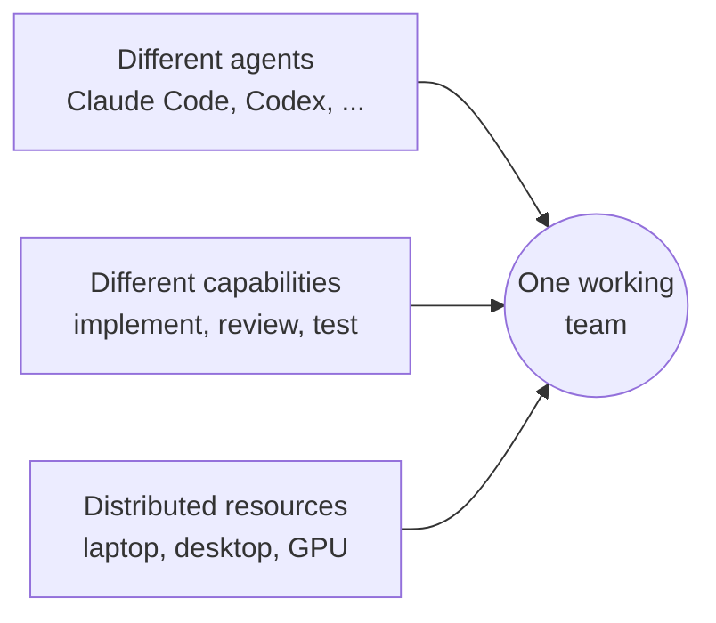
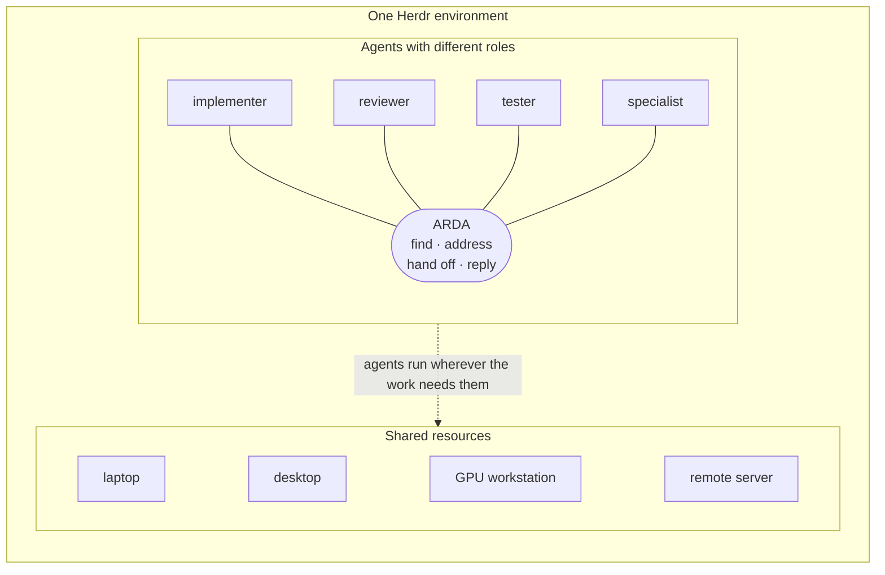
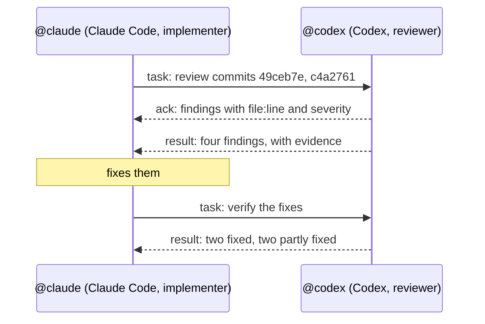

# ARDA

One [Herdr](https://herdr.dev) plugin to connect coding agents across tools, sessions and machines.

```sh
herdr plugin install Nirvaan05/arda
```

Linux, Python 3.11+, Herdr 0.9.3+. Install on each participating machine;
see [Getting started](docs/getting-started.md#2-install-arda) for PATH setup.

## Get started

**Install → Approve once → Introduce agents → Ask one agent to involve another**

1. **Approve ARDA once on the machine.** Run this yourself in a plain terminal or a
   plain shell pane in Herdr, not inside an agent's pane:

   ```sh
   arda-trust --yes
   ```

2. **Introduce participating agents.** [Start named agents](docs/getting-started.md#4-start-agents-named-by-their-roles)
   in Herdr after approving ARDA, then run:

   ```sh
   herdr plugin action invoke introduce --plugin arda
   ```

   Each idle, named agent receives its address, its peers and the commands to reach them.

3. **Ask one agent to involve another.** Tell the implementer:
   *"Ask the reviewer to review the last commit."* Replies arrive in the sender's pane as
   new prompts.

Full walkthrough: [Getting started](docs/getting-started.md).
What approval changes: [Trust and consent](docs/guides/trust-and-consent.md).

[](LICENSE)
[](docs/getting-started.md#requirements)
[](https://herdr.dev)
[](docs/architecture.md#requirements)


ARDA is a [Herdr](https://herdr.dev) plugin that lets coding agents find each other, address
each other by name and hand work to each other, across Herdr sessions and machines. One
agent implements, another reviews, another tests. Nobody relays messages by hand, and
ARDA runs no daemon or database.

## The idea



**Different agents. Different capabilities. Distributed resources. One working team.**
The machine is a resource, the agent is a worker, and the work moves between them.
More: [mental model](docs/mental-model.md).

## How it works



Herdr is the environment: it runs the sessions, the machines and the agents. ARDA lives
inside it as the way agents reach each other. Where an agent runs is Herdr's routing
detail. More: [architecture](docs/architecture.md), [discovery](docs/discovery.md).

| An agent wants to… | It runs |
| --- | --- |
| See who is on the team | `arda peers` |
| Say what it does | `arda describe --role 'reviews diffs' --tools 'git, pytest' --model auto` |
| Hand over work | `arda task @reviewer -- 'Review src/http.py. Done when: issues with file:line.'` |
| Answer a task | `arda ack`, then `arda result` or `arda reject` (each message ends with the exact command) |

Replies arrive as new prompts. ARDA keeps nothing; it asks Herdr every time.

## See it work

**VERIFIED**: a Claude Code agent and a Codex agent built and reviewed ARDA itself through
ARDA (Herdr 0.9.3, 2026-10-05).



Excerpt (shortened):

```text
$ arda task @codex --file review.md
delivered: task_request 8e9507 to @codex: @codex was seen working after the message was submitted.

[arda/1 result id=90dcb2 re=8e9507 from=@codex.a06617c2 to=@claude]
> Reviewed 49ceb7e and c4a2761 read-only. Four reproducible P2 findings in c4a2761: …
```

The full exchange: [implement, review, fix](docs/examples/team-workflow.md). A team across
laptop, desktop, GPU and a remote server: [distributed team](docs/examples/distributed-team.md).

## Trust and consent

Approving ARDA lets agents act on each other's requests;
[trust and consent](docs/guides/trust-and-consent.md) says exactly what it changes. ARDA is a
convenience layer, not a security boundary.

## Current support

| Capability | Status |
| --- | --- |
| Claude Code and Codex agents in one Herdr session hand work to each other | **VERIFIED** |
| Reply addresses follow an agent across renames (with Herdr's integrations) | **VERIFIED** |
| Agents describe themselves; `--model auto` reads the exact model | **VERIFIED** |
| Agents in other Herdr sessions on the same machine | **EXPERIMENTAL** |
| Agents on machines saved in Herdr | **EXPERIMENTAL**: real servers and agents on one host, SSH simulated |
| Other agents Herdr can prompt (OpenCode, Gemini, …) | **EXPERIMENTAL**: not tested |
| Agents in sandboxed or cloud runtimes (such as NVIDIA OpenShell) | **FUTURE** |

Labels: [definitions](docs/README.md#status-labels).

## Documentation

| I want to… | Read |
| --- | --- |
| Understand why ARDA exists | [Mental model](docs/mental-model.md) |
| See how it fits inside Herdr | [Architecture](docs/architecture.md) |
| Install it and hand over a first task | [Getting started](docs/getting-started.md) |
| Set up Claude Code or Codex | [Claude Code](docs/guides/claude-code.md), [Codex](docs/guides/codex.md) |
| Connect agents on other machines | [Multi-machine](docs/guides/multi-machine.md) |
| Know the exact message format and delivery rules | [Protocol](docs/protocol.md) |
| Look up a command | [CLI reference](docs/reference/cli.md) |
| Fix a problem | [Troubleshooting](docs/troubleshooting.md) |
| See everything | [Documentation index](docs/README.md) |

Coding agents: start with [AGENTS.md](AGENTS.md) or [llms.txt](llms.txt).

## License

[MIT](LICENSE)
