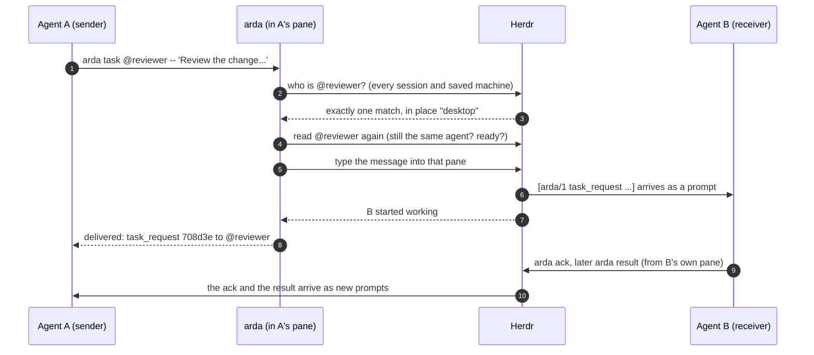
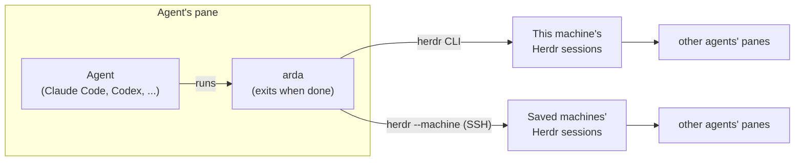

# Architecture

> **How ARDA fits inside Herdr.** Herdr runs the environment. ARDA is a short-lived command
> that agents run to reach each other through it. ARDA keeps no state.

## Who does what

| Herdr (the environment) | ARDA (the plugin) |
| --- | --- |
| Runs sessions, panes and agent processes | Gives agents addresses: `@name`, `@name@place` |
| Detects agents and their state (idle, working, blocked) | Defines five message types and their wire format |
| Reaches saved machines over SSH (`herdr --machine`) | Looks a name up across every place and refuses to guess |
| Types text into an agent's terminal (`herdr agent prompt`) | Checks the receiver again right before typing |
| Keeps pane metadata (used for self-descriptions) | Reports what Herdr can confirm: delivered, submitted, uncertain, not delivered |
| Reports each agent's conversation (official integrations) | Uses that conversation as a reply address that survives renames |

## The path of one message

Text equivalent: the sender runs `arda`, which asks Herdr where the named agent is, checks
it again, and has Herdr type the message into its pane. The receiver answers by running
`arda` itself. Nothing waits in between: each reply is a new prompt.

## What runs where

- `arda` is a Python standard-library program. It starts, calls the `herdr` CLI, prints a
  result and exits. There is no daemon, server, database, queue or MCP server.
- It identifies the calling agent from its own Herdr pane (`HERDR_PANE_ID`, checked
  against the pane's processes), so `from=` is filled in by ARDA, not by the agent.
- It finds `herdr` from the Herdr server it runs under, or from the standard install
  places, never from the environment.

## What ARDA keeps

Nothing. Every send asks Herdr again.

| Information | Where it lives |
| --- | --- |
| Which agents exist, their names and state | Herdr, read on every command |
| A task's history and outcome | The agents' own conversations, and the project (commits, files) |
| Self-descriptions (role, tools, model) | Herdr pane metadata, lost when the Herdr server restarts |
| The user's approval | Each harness's own configuration, written by `arda-trust` |

## Code map

| Path | What it does |
| --- | --- |
| [`bin/arda`](../bin/arda) | Entry point. Runs the plugin's code with the system `python3` in isolated mode, wherever it is linked from. |
| [`bin/arda-trust`](../bin/arda-trust) | Separate entry point for the user's one-time approval. |
| [`arda/cli.py`](../arda/cli.py) | Commands, identity of the caller, delivery, `peers` listing, `describe`. |
| [`arda/envelope.py`](../arda/envelope.py) | Addresses, message types, wire format, text cleaning, native tokens. |
| [`arda/topology.py`](../arda/topology.py) | Places (sessions and saved machines), surveys, strict name resolution. |
| [`arda/herdr.py`](../arda/herdr.py) | Calls to the `herdr` CLI, timeouts, failure classes for saved machines. |
| [`arda/harness.py`](../arda/harness.py) | `--model auto`: the model from the agent's own session log. |
| [`arda/trust.py`](../arda/trust.py) | What `arda-trust` writes into Claude Code and Codex configuration. |
| [`herdr-plugin.toml`](../herdr-plugin.toml) | Plugin manifest: actions **ARDA status**, **ARDA: show setup** and **ARDA: introduce the agents to each other**. |
| [`skills/`](../skills) | Agent skills: `arda` (for agents), `arda-peers` and `arda-setup` (for the user). |
| [`tests/`](../tests) | Unit and CLI tests against a fake `herdr`; they never reach a real Herdr server. |

## Requirements

| | |
| --- | --- |
| Platform | Linux |
| Python | 3.11 or later, standard library only |
| Herdr | 0.9.3 or later |
| Agents | Any agent Herdr can prompt; tested with Claude Code and Codex |

## Limits

- ARDA relies on Herdr's view of an agent's state. Herdr 0.9.3 does not always recognize a
  harness's own dialogs as blocked (Claude Code's end-of-turn tips, for example), and a
  message typed then lands in that dialog.
- Delivery is at most once. ARDA does not retry, queue or store messages.
- A survey asks at most eight places at a time and one at a time per saved machine. A
  lookup gives up after 5 seconds on this machine and 15 on a saved machine; a whole survey
  stops after 30 seconds.
- Self-descriptions are unverified claims, at most 80 characters per field.
- ARDA has no adapters for sandboxes or cloud runtimes. Their agents can take part once
  Herdr can reach them.

## Next

- [Discovery and routing](discovery.md): how a name is found across sessions and machines.
- [Protocol](protocol.md): the exact message format and delivery rules.
