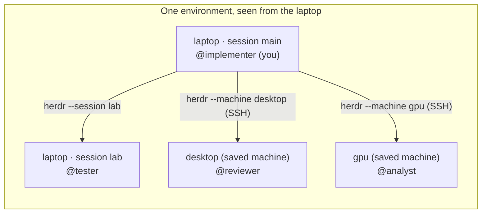
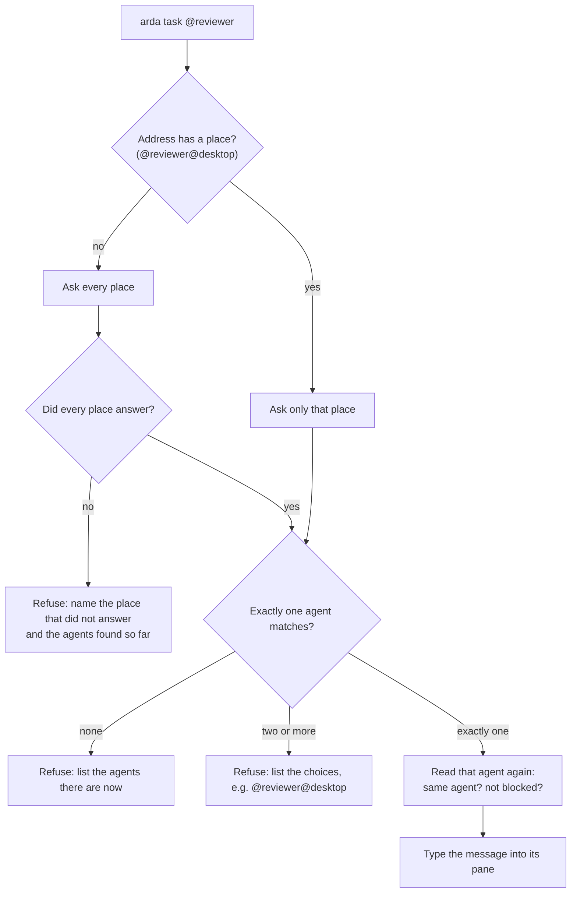

# Discovery and routing

> **How ARDA finds an agent by name** across Herdr sessions and machines, and when it
> refuses to send. The exact rules are in the [protocol](protocol.md#addresses).

## The environment

Herdr runs one server per session on each machine. A machine saved in Herdr
(`herdr machine add`) is another machine's Herdr server, reached over SSH with
`herdr --machine`. ARDA treats everything one machine can reach as one environment:

| Place | What it is | How ARDA reaches it |
| --- | --- | --- |
| Your session | The Herdr session your pane is in | Its socket |
| Other local sessions | Every other running Herdr session on this machine | `herdr --session NAME` |
| Saved machines | Every enabled machine saved in Herdr | `herdr --machine ID`, over SSH |



Text equivalent: from the laptop, ARDA can reach its own session, any other running
session on the laptop, and each saved machine. Which machine an agent runs on is routing
detail: agents are addressed by name.

`arda peers` lists every place and its agents:

```text
$ arda peers
2 agents in 2 places: 1 working, 1 idle; 1 place did not answer

main · Herdr session on this machine (laptop) · you are here
  ● @implementer  claude  working  ~/src/app  (you)
      • Role:  "implements features in src/"
      • Tools: "pytest, ruff"

desktop · saved machine desktop, Herdr session default
  ○ @reviewer     codex   idle     /home/me/src/app
      • Role:  "reviews diffs for correctness and security"

gpu · saved machine gpu, Herdr session default
  ✗ unreachable: machine_unreachable: ...

Role, tools, model: each agent's own claim (arda describe), not verified.
```

Each row starts with the agent's state: ● working, ○ idle or done, ! blocked (waiting for
its user), ? unknown. The Role, Tools and Model lines are what the agent said about itself
with `arda describe`.

## How a name is resolved

ARDA sends only when it can show the address names exactly one agent. It never guesses.



Text equivalent: an address without a place is looked up in every place, and sent only if
every place answered and exactly one agent matched. An address with a place needs only
that place. Right before typing, ARDA reads the receiver again and checks it is the same
agent.

| Situation | What ARDA does |
| --- | --- |
| One agent has the name | Sends to it. |
| The name runs in two places | Refuses and lists `@name@place` choices. |
| A place does not answer | Refuses, unless the address names another place. |
| The agent was renamed | The old name is refused with the current agents. A reply address with a native token (`@name.s…`) follows the agent to its new name. |
| The agent is waiting at an approval prompt | Types nothing (`not_delivered`). |

## Replies and the way back

A reply goes to the sender's address (`@implementer.s…`), which the receiver resolves in
its own environment. Herdr gives a remote server no route back to the caller, so:

- For two machines to talk both ways, each must have the other saved in Herdr, and both
  need `arda` on their PATH.
- A machine that cannot reach the sender cannot reply to it. ARDA reports that instead of
  guessing.

See the [multi-machine guide](guides/multi-machine.md) for the setup.

## When a place does not answer

| Reason shown | Meaning | What to do |
| --- | --- | --- |
| `machine_unreachable` | The machine cannot be reached over SSH. | Address agents with their place, or run `herdr machine disable ID` while it is offline. |
| `server_not_running` | The machine is reachable but its Herdr session is not running. | Start Herdr there. |
| `machine_auth` | The machine refused the SSH login. | `herdr machine reconnect ID` |
| `protocol_mismatch` | The machine runs a Herdr version that does not match. | Update Herdr on both machines. |

ARDA cannot prove that two places reach the same Herdr server (for example, a saved
machine that points back at this one), so it lists both, and a name seen through both
needs its place.

## Budgets

| Limit | Value |
| --- | --- |
| Places asked at once | 8, and one at a time per saved machine |
| One lookup on this machine | 5 seconds |
| One lookup on a saved machine | 15 seconds |
| A whole survey | 30 seconds; places not asked in time are reported as not asked |

Herdr shares one SSH connection per saved machine by default (`[remote] manage_ssh_config`
in Herdr's configuration).
