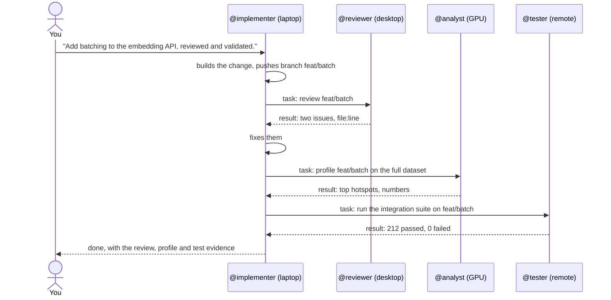
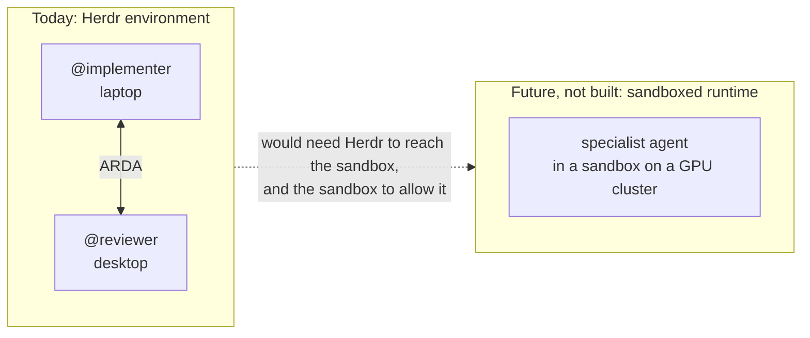

# Example: a distributed team

> **ILLUSTRATIVE, with parts VERIFIED and EXPERIMENTAL.** A team of agents with different
> roles, spread over several machines in one Herdr environment. The table at the end says
> exactly what has been run and what has not.

## The team

| Agent | Harness | Role | Runs on (today) |
| --- | --- | --- | --- |
| `@implementer` | Claude Code | Builds the change | Laptop |
| `@reviewer` | Codex | Reviews it independently | Desktop |
| `@analyst` | A local-model agent | Heavy or private analysis | GPU workstation |
| `@tester` | Any agent Herdr can prompt | Runs validation | Remote server |

The machines are only where the agents run today. The team is the abstraction: agents
are addressed by role, and Herdr routes to wherever they are.


## The workflow



Text equivalent: you give the implementer the objective. It hands review, analysis and
validation to the agents whose roles fit, each with a clear task, and collects their
results. You approve the outcome; the agents handle the handoffs.

The commands are the same as on one machine:

```text
implementer$ arda task @reviewer -- 'Review branch feat/batch (pushed). Done when: issues with file:line, or "no issues".'
implementer$ arda task @analyst -- 'Profile feat/batch on the full dataset. Done when: top 5 hotspots with timings.'
implementer$ arda task @tester -- 'Run the integration suite on feat/batch. Done when: pass/fail counts and failing test names.'
```

The branch is pushed because a path or an unpushed commit on the laptop cannot be read on
another machine.

## What is verified

| Part | Status | Evidence |
| --- | --- | --- |
| Claude Code and Codex agents handing work to each other | VERIFIED | Live in one Herdr session ([team workflow](team-workflow.md)) |
| A chain of agents across saved machines | EXPERIMENTAL | Real Herdr servers and real Claude Code and Codex agents, on one host with SSH simulated; not yet between physical machines |
| A local-model agent | Not tested | It must be an agent Herdr can detect and prompt |
| This exact four-machine team | ILLUSTRATIVE | Not run as shown |

Setup for several machines: [multi-machine guide](../guides/multi-machine.md).

## Where ARDA is going: sandboxed runtimes

**FUTURE.** ARDA has no integration with sandboxed agent runtimes today.

[NVIDIA OpenShell](https://docs.nvidia.com/openshell/latest/) is an example of another kind
of place agents can run. Its documentation describes it as "the safe, private runtime for
fleets of autonomous AI agents" and lists running "Claude Code, OpenCode, Codex, or GitHub
Copilot CLI with constrained file and network access." Its
[architecture](https://docs.nvidia.com/openshell/about/architecture) has a gateway that is
its control plane, and its [sandbox runtimes](https://docs.nvidia.com/openshell/latest/how-it-works/sandboxes/runtimes)
include Docker, Podman, MicroVM and Kubernetes, the last for "shared clusters, remote
compute, and GPU scheduling."



For such an agent to join an ARDA team, Herdr would have to reach it, and the sandbox's
network policy would have to allow ARDA's path (the agent runs `arda`, which calls
`herdr`, which may use SSH). Neither has been built or tested. ARDA's rule stays the same:
an agent can take part once Herdr can reach it.
