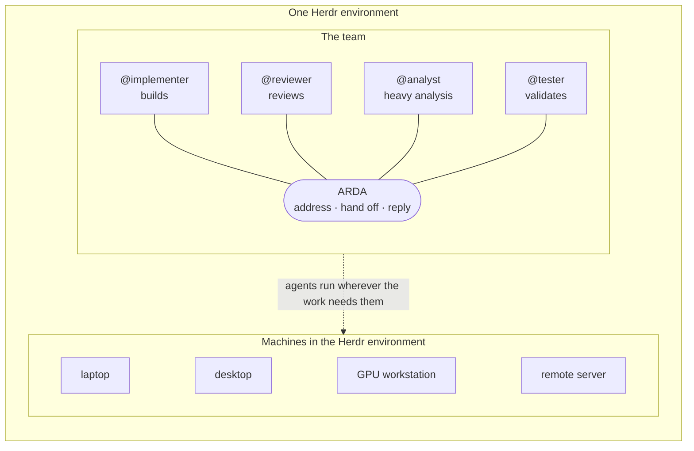
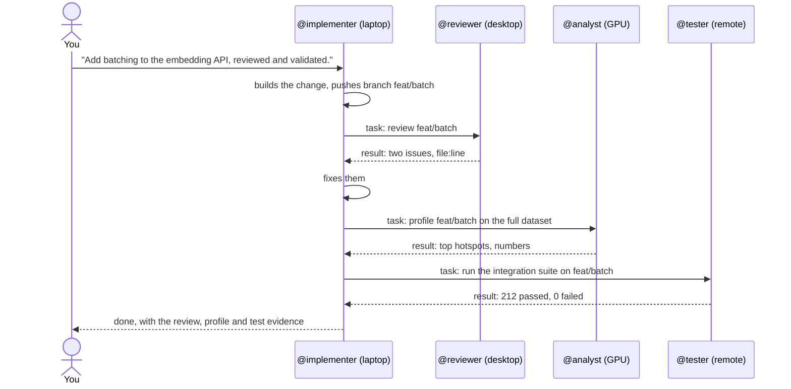
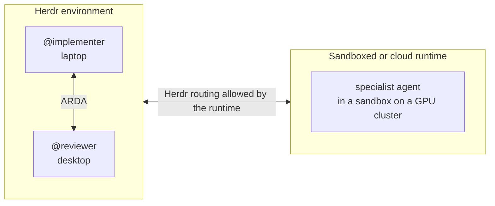

# Example: a distributed team

> **ILLUSTRATIVE workflow using VERIFIED capabilities.** A team of agents with different
> roles, spread over several machines in one Herdr environment. The table at the end
> distinguishes verified support from this example's particular team.

## The team

| Agent | Harness | Role | Runs on (today) |
| --- | --- | --- | --- |
| `@implementer` | Claude Code | Builds the change | Laptop |
| `@reviewer` | Codex | Reviews it independently | Desktop |
| `@analyst` | A local-model agent | Heavy or private analysis | GPU workstation |
| `@tester` | Any agent Herdr can prompt | Runs validation | Remote server |

The machines are only where the agents run today. The team is the abstraction: agents
are addressed by role, and Herdr routes to wherever they are.



## The workflow



Text equivalent: you give the implementer the objective. It hands review, analysis and
validation to the agents whose roles fit, each with a clear task, and collects their
results. You approve the outcome; the agents handle the handoffs.

The commands are the same as on one machine:

```text
implementer$ arda task @reviewer -- 'Review branch feat/batch (pushed). Done when: issues with file:line, or "no issues".'
implementer$ arda task @analyst -- 'Profile feat/batch on the full dataset. Done when: top 5 hotspots with timings.'
implementer$ arda task @tester -- 'Run the integration suite on feat/batch. Done when: pass/fail counts and failing test names.'
```

The branch is pushed because a path or an unpushed commit on the laptop cannot be read on
another machine.

## What is verified

| Part | Status | Evidence |
| --- | --- | --- |
| Claude Code and Codex agents handing work to each other | VERIFIED | Live in one Herdr session ([team workflow](team-workflow.md)) |
| Agents in other Herdr sessions on the same machine | VERIFIED | Live verification by the maintainer |
| A chain of agents across saved machines | VERIFIED | Live verification by the maintainer across physical machines |
| Other agents Herdr can prompt, including OpenCode and Gemini | VERIFIED | Live verification by the maintainer |
| Agents in sandboxed or cloud runtimes | VERIFIED | Live verification by the maintainer with Herdr able to reach the agents |
| This example's local-model analyst | ILLUSTRATIVE | The selected agent must be one Herdr can detect and prompt |
| This exact four-machine team | ILLUSTRATIVE | Not run as shown |

Setup for several machines: [multi-machine guide](../guides/multi-machine.md).

## Sandboxed and cloud runtimes

**VERIFIED.** The maintainer has verified agents in sandboxed and cloud runtimes
participating through Herdr.

Runtimes such as [NVIDIA OpenShell](https://docs.nvidia.com/openshell/latest/) are another
place an agent can run. ARDA uses Herdr's discovery and routing to reach the agent.



Herdr must be able to reach the agent, and the runtime's process and network policies
must allow ARDA's path: the agent runs `arda`, which calls `herdr`, which may use SSH.
Configure those permissions for the runtime in use. ARDA requires no runtime-specific
adapter.
