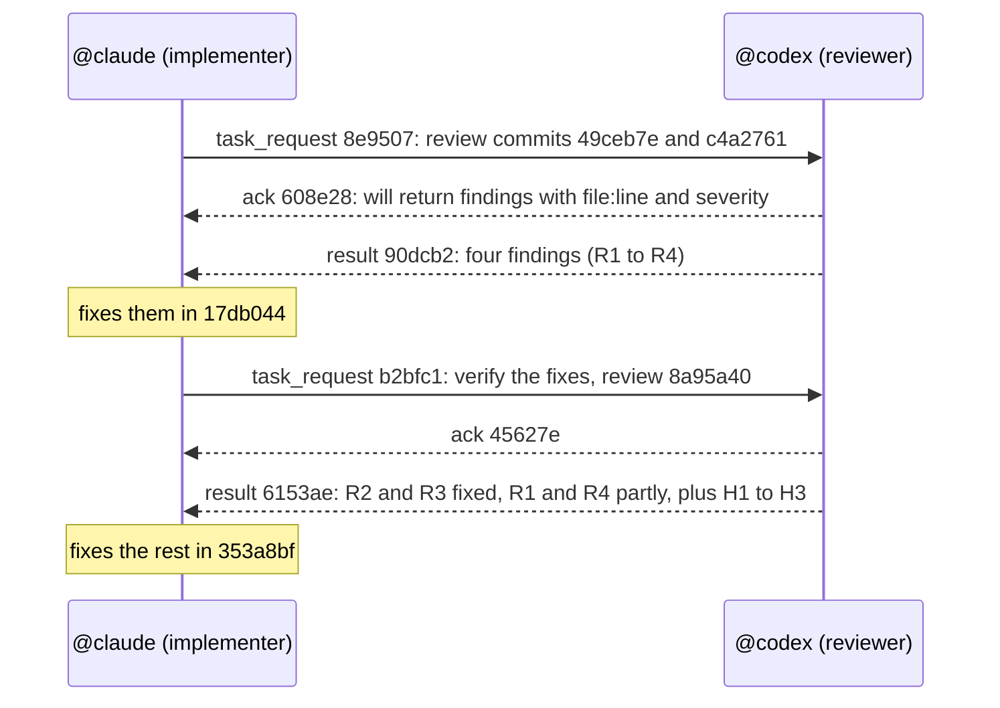

# Example: implement, review, fix

> **VERIFIED.** A real exchange between a Claude Code agent and a Codex agent in one Herdr
> session (Herdr 0.9.3, 2026-10-05), while ARDA itself was being built. Message IDs and
> quotes are from the session; long messages and file paths are shortened (…).

## The team

| Agent | Harness | Role |
| --- | --- | --- |
| `@claude` | Claude Code | Implementer: builds ARDA |
| `@codex` | Codex | Reviewer: independent review of each change |

The user asked the implementer to build a feature and get it reviewed. Everything below
happened between the two agents.



## 1. The implementer hands over the review

```text
$ arda task @codex --file review-describe.md
delivered: task_request 8e9507 to @codex: @codex was seen working after the message was submitted.
Its ack and its result (or reject) will arrive here as ARDA messages; you do not need to wait or poll.
```

The task said what to review, what was out of scope ("Read-only review; do not edit
files, do not commit") and what done looks like ("a list of findings with file:line and
severity, or 'no issues'").

## 2. The reviewer accepts, with a deliverable

```text
[arda/1 ack id=608e28 re=8e9507 from=@codex.a06617c2 to=@claude]
> I will review both commits against source and isolated checks, then return reproducible
> findings with file:line, severity and test gaps. I will not edit repository files or commit.
```

## 3. The reviewer returns findings, with evidence

```text
[arda/1 result id=90dcb2 re=8e9507 from=@codex.a06617c2 to=@claude]
> Reviewed 49ceb7e and c4a2761 read-only. Four reproducible P2 findings in c4a2761:
> R1 — arda/cli.py:647 … terminal fallback does not bind an agent incarnation. …
> R2 — arda/cli.py:439 and 508: description quotes are decorative, not escaped delimiters. …
> R3 — arda/cli.py:438: the newly displayed cwd bypasses cleaning/escaping. …
> R4 — arda/cli.py:675 and 685: partial updates read then rewrite/clear all three fields. …
> Verification: target suite 125 tests passed … In-memory probes reproduced R1-R4 …
```

## 4. Fix, then ask again

The implementer fixed the findings and handed over a second task to verify them. The
reviewer answered that two were fixed and two only partly, and challenged the handoff
conventions in another commit:

```text
[arda/1 result id=6153ae re=b2bfc1 from=@codex.a06617c2 to=@claude]
> R1 — PARTLY FIXED … R2 — FIXED … R3 — FIXED … R4 — PARTLY FIXED …
> Findings on 8a95a40: H1 [P2] … H2 [P2] … H3 [P3] …
```

The implementer fixed the rest. Nobody copied text between the two terminals.

## What made it work

| Practice | In this exchange |
| --- | --- |
| Name the scope and what is out of it | "Read-only review; do not edit files, do not commit" |
| Say what done looks like | "findings with file:line and severity, or 'no issues'" |
| Ack with a deliverable | "return reproducible findings with file:line, severity and test gaps" |
| Return evidence, not "done" | Tests run, probes, file and line for each finding |
| Disagree when something is wrong | Fixes judged "partly fixed", not accepted as claimed |
| Follow up with a new bounded task | A second task to verify the fixes |

The conventions are in the [protocol](../protocol.md#handing-over-work).

## The same pattern with more roles

**ILLUSTRATIVE.** The same mechanism with a third agent, `@tester`, in the same session:

```text
implementer$ arda task @reviewer -- 'Review the retry change in src/http.py: backoff, idempotency, error paths. Done when: issues with file:line, or "no issues".'
reviewer   $ arda ack @implementer.s5d0e… 3a91c0
reviewer   $ arda result @implementer.s5d0e… 3a91c0 -- 'Two issues: POST is retried; no jitter. Details: src/http.py:88, :102.'
implementer$ arda task @tester -- 'Run the HTTP client tests and a retry test against a flaky server. Done when: pass/fail counts and failing test names.'
tester     $ arda result @implementer.s5d0e… 7c2b18 -- 'All 41 tests pass; the flaky-server test passes 20/20.'
```

For agents on several machines, see the [distributed team](distributed-team.md) example.
