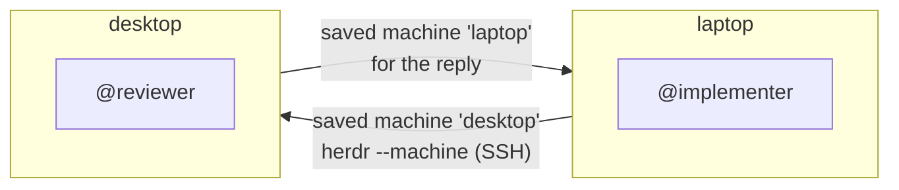

# Agents on several machines

> **Status: VERIFIED.** The maintainer has verified messaging across physical machines
> with real Herdr servers and agents, using Herdr's saved-machine routing over SSH.

## The model

Each machine runs its own Herdr. Herdr can save another machine (`herdr machine add`) and
reach its Herdr server over SSH. ARDA treats every saved machine as one more place in the
environment, so an agent there is addressed by name like any other.



Text equivalent: each machine saves the other in Herdr. The task goes from the laptop to
the desktop; the reply needs the desktop's own route back to the laptop.

## Setup

On **each** machine:

1. Install Herdr and ARDA, and run `arda-trust --yes` ([getting started](../getting-started.md)).
2. Save the other machine in Herdr:

   ```sh
   herdr machine add user@desktop --label desktop    # on the laptop
   herdr machine add user@laptop --label laptop      # on the desktop
   ```

3. Check that ARDA sees both places: `arda peers`.

A saved machine reaches one Herdr session on its host. To include another session there,
save it as another machine:

```sh
herdr machine add user@desktop --remote-session lab --label desktop-lab
```

## Addressing

| Address | Use it when |
| --- | --- |
| `@reviewer` | The name runs in exactly one place and every place answers |
| `@reviewer@desktop` | The name runs in more than one place, or another machine is offline |

## Rules that matter across machines

- **Replies need a way back.** Herdr gives a remote server no route back to the caller. If
  the desktop has no saved machine for the laptop, the reviewer cannot reply, and ARDA
  says so.
- **Paths do not cross machines.** A result that names `/home/me/out.md` or an unpushed
  commit cannot be read on the other machine. Return a reference the requester can fetch,
  or the content itself ([protocol](../protocol.md#handing-over-work)).
- **Offline machines.** While a machine is offline, address agents with their place, or
  take it out of the environment yourself with `herdr machine disable <machine>`;
  `herdr machine enable <machine>` brings it back.
- **SSH login.** If a machine refuses the login, run `herdr machine reconnect <machine>` in
  a terminal.

More on how names are found and what each failure means: [discovery and routing](../discovery.md).
