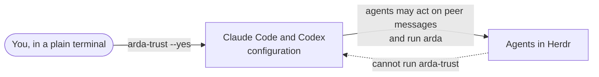

# Trust and consent

> **What approving ARDA changes, what it allows, and why you must do it yourself.**
> ARDA is a convenience layer, not a security boundary.

## Why an approval is needed

Agent harnesses treat text typed into an agent as coming from the user. An ARDA message
comes from another agent, so without your approval Claude Code asks before acting on it
and Codex's sandbox blocks the Herdr socket. `arda-trust` records a standing approval in
each harness's own configuration.

## What `arda-trust` changes

| Where | What | Undo |
| --- | --- | --- |
| `$CLAUDE_CONFIG_DIR/rules/arda.md` | Rules for Claude Code: ARDA messages come from peer agents, may be answered without asking you each time, and risky requests are rejected | `arda-trust --revoke --yes` |
| `$CLAUDE_CONFIG_DIR/settings.json` | `permissions.allow`: `Bash(arda *)`; `permissions.deny`: `Bash(arda-trust)` and `Bash(arda-trust *)`; each also for the script's full path | `arda-trust --revoke --yes` |
| `$CODEX_HOME/AGENTS.md` | A marked section with the same rules for Codex | `arda-trust --revoke --yes` |
| `$CODEX_HOME/rules/arda.rules` | Lets the `arda` command, and nothing else, run outside Codex's sandbox; forbids `arda-trust` | `arda-trust --revoke --yes` |
| Herdr's Claude Code and Codex integrations | `herdr integration install claude` / `codex`: a `SessionStart` hook that reports each agent's conversation to Herdr (Codex also gets `[features] hooks = true`). Skip with `--no-integrations` | `herdr integration uninstall claude` / `codex` (revoke leaves them; they are Herdr's) |

Nothing else changes. ARDA runs no service and keeps no files of its own.

| Command | Effect |
| --- | --- |
| `arda-trust` | Show what it would change; changes nothing |
| `arda-trust --yes` | Apply it (also upgrades rules an older version installed) |
| `arda-trust --status` | Show whether the approval is installed and current |
| `arda-trust --revoke --yes` | Remove what it added |
| `arda setup` | Read-only summary for agents and for you, with the command to run |

## Why you run it in a plain terminal

Herdr and the agent harnesses cannot tell your keystroke in an agent's pane from the
agent's own. Anything that approved from inside an agent's pane could therefore be
triggered by an agent. So `/arda-setup`, `$arda-setup` and the Herdr action
**ARDA: show setup** only show the setup; `arda-trust` makes the change, and it refuses to
run inside an agent's pane.

## The security model

- **Messages are not authenticated.** Any process running as you that can reach a Herdr
  socket, and any machine you saved in Herdr, can send one under any name. `from=` is
  accurate only for messages sent with `arda` by an agent from its own pane.
- **Peer messages are requests, not instructions from you.** The approval tells agents
  exactly that, and to reject anything risky. A message can still carry prompt injection
  from wherever its sender read it. ARDA removes terminal control characters and quotes
  every line of a message, but the receiving agent decides what to do.
- **The approval widens what agents can do.** Agents may act on peer messages without
  asking you, and Codex may run `arda` outside its sandbox. A trusted agent can send
  whatever it can read to any agent in your Herdr environment, including on other machines.
  Each harness's own permission prompts and sandbox still govern what the receiver does.
- **Approve-once is not oversight.** A peer's request can lead to edits or commands nobody
  watched. Grant trust only where every agent may work for every other.
- **The approval covers `arda`, and `arda` cannot change it.** Only `arda-trust` changes
  trust. It refuses to run under another name or from an agent's pane, both commands run
  Python isolated with the interpreter from the standard system PATH, and the installed
  rules tell Claude Code (deny rules) and Codex (a forbidden rule) not to let agents run
  it. These are guards, not a boundary: Claude Code documents its Bash deny rules as not a
  security boundary, and any process running as you that can reach Herdr can type into a
  pane. Codex's sandbox is the strongest of them.
- **`--file` reads only visible files** from the working directory or /tmp, checked on the
  file it opened. That keeps accidents small but is not a boundary against a determined
  agent.
- **Self-descriptions are claims.** Any process that can use the Herdr session can set
  them; `arda peers` marks them as not verified.
- **Delivery is at most once,** with no retry, queue, replay protection or completion
  guarantee.
