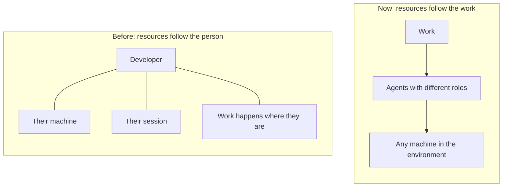
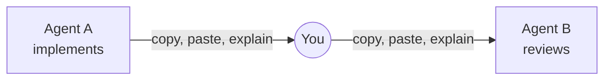
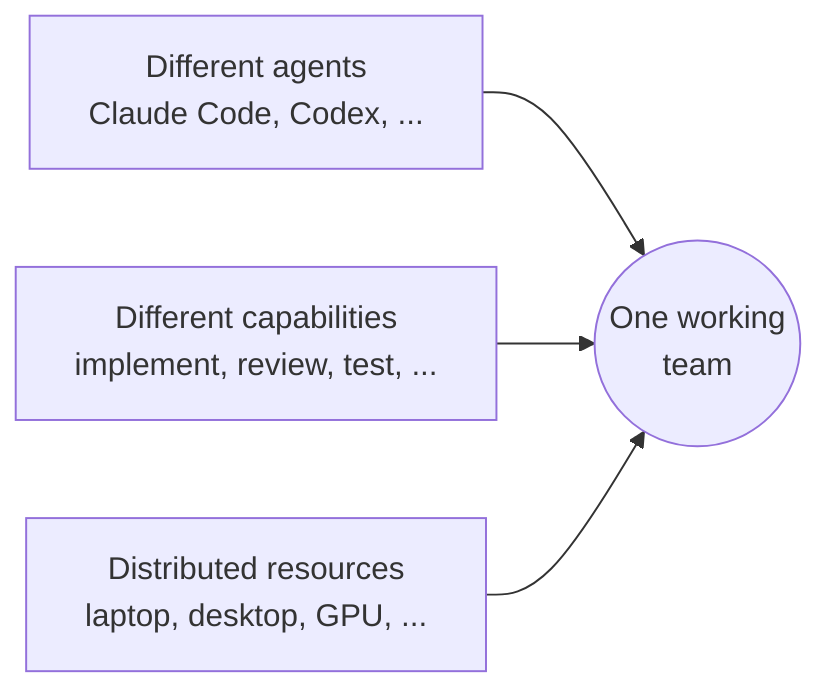
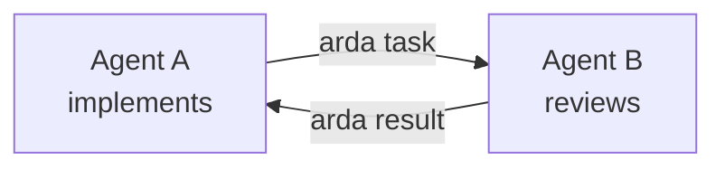
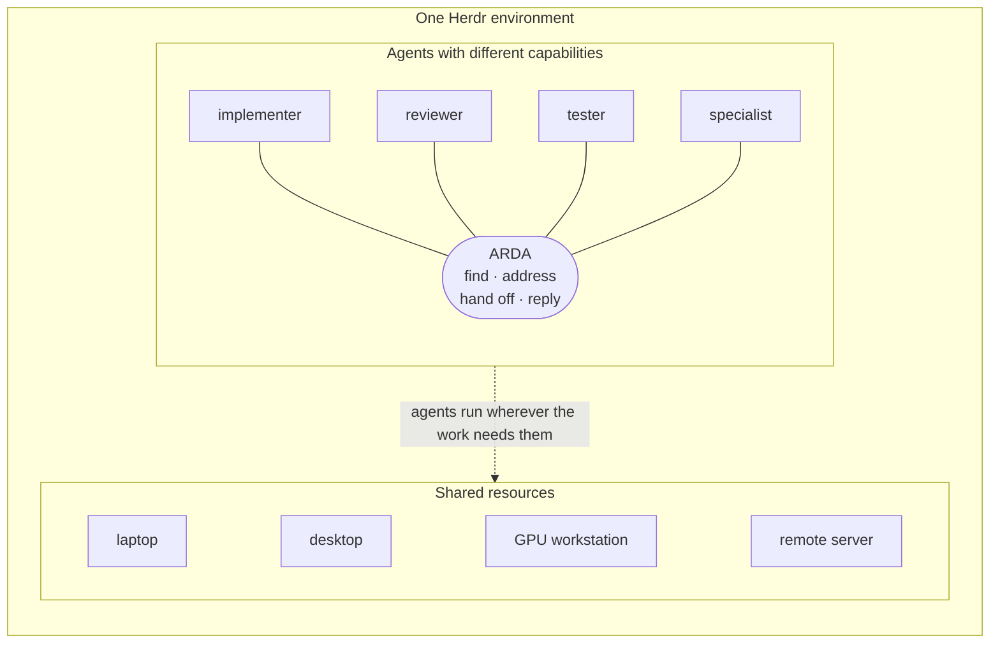

# Mental model

> **Why ARDA exists.** Different agents, with different capabilities, running on
> distributed resources, working as one team inside one Herdr environment.

## The shift: resources organized around work

AI has changed how much one person or a small team can take on. One person can work across
the stack, run work in parallel and hand work to agents.

The old model organized resources around people. The new one organizes them around work.

| Before | Now |
| --- | --- |
| A machine belongs to a person. | A machine is a resource. |
| A session belongs to a person. | An agent is a worker. |
| Work happens where the developer is. | Work moves to the agent that fits it. |

## The problem: the human is the relay

Agents are workers now, but each one is isolated by its harness, session, machine or
runtime. When one agent needs another, a person copies context from one terminal to the
next.

## The idea: one working team

[Herdr](https://herdr.dev) already brings the sessions and machines those agents run on
into one environment. ARDA is the Herdr plugin that lets the agents inside it find each
other, address each other by name, hand work over and get the results back.

## Why a team of different agents

- **They are worth having because they differ:** in model, tools, runtime, cost, speed and
  the machine they sit on. Give each piece of work to the agent it fits, not to the
  strongest agent every time.
- **The agent holding the task decides whom to ask.** It has the context. ARDA does not
  route, rank or pick agents; it only lets them reach each other.
- **Name agents by role** (`@reviewer`, `@tester`), so whatever agent fills a role can
  change without changing how the team works. Agents can also say what they do
  (`arda describe`), and `arda peers` shows it.
- **Hand off with a clear contract:** what to do, what done looks like and what to send
  back. The [protocol](protocol.md#handing-over-work) lists the conventions.
- **More agents is not automatically better.** Watch whether the handoffs improve the work.

Typical roles:

| Role | Example work |
| --- | --- |
| Implementer | Builds the change. |
| Reviewer | Reviews it independently, ideally on another model. |
| Tester | Runs validation and reports pass or fail with evidence. |
| Security | Audits a change for risky patterns. |
| Researcher | Reads sources and summarizes what matters. |
| Local-model specialist | Runs heavy or private work next to a local model. |

## Herdr is the environment; ARDA lives inside it

Text equivalent: Herdr is the container. Inside it are agents with different roles and
the machines they can run on. ARDA is the capability that lets the agents reach each other.
Which machine an agent runs on is routing detail, handled by Herdr.

| ARDA is | ARDA is not |
| --- | --- |
| A Herdr plugin: a short-lived `arda` command that agents run | A daemon, server, database, queue or MCP server |
| Addresses and a small protocol for handing work over | A control plane, scheduler or orchestrator |
| Peer to peer: the agent with the task picks the peer | A router that decides who does what |
| Built on Herdr's discovery, routing and delivery | A second runtime beside Herdr |

## Compared with other approaches

| | ARDA | Relaying by hand | Plain `herdr agent prompt` | Mailbox tools (e.g. MCP Agent Mail) | A2A |
| --- | --- | --- | --- | --- | --- |
| Extra server, daemon or database | None | None | None | A message store; some run an HTTP server | An HTTP server per agent |
| Finds agents by name across Herdr sessions and saved machines | Yes | You do it | One Herdr server at a time | Within their own registry | Through Agent Cards and URLs |
| Task, ack, result convention | Yes | You do it | No | Messages and threads | Yes, with task states |
| Works with the Claude Code and Codex you already run in Herdr | Yes | Yes | Yes | Through MCP tools or hooks | Needs an A2A server around each agent |
| Durable message history | No; agents keep their own context | No | No | Yes | Depends on the server |

ARDA's message types map onto A2A's task states; see [relation to A2A](protocol.md#handing-over-work).

## Next

- [Architecture](architecture.md): what Herdr does and what ARDA does.
- [Getting started](getting-started.md): install and send a first task.
